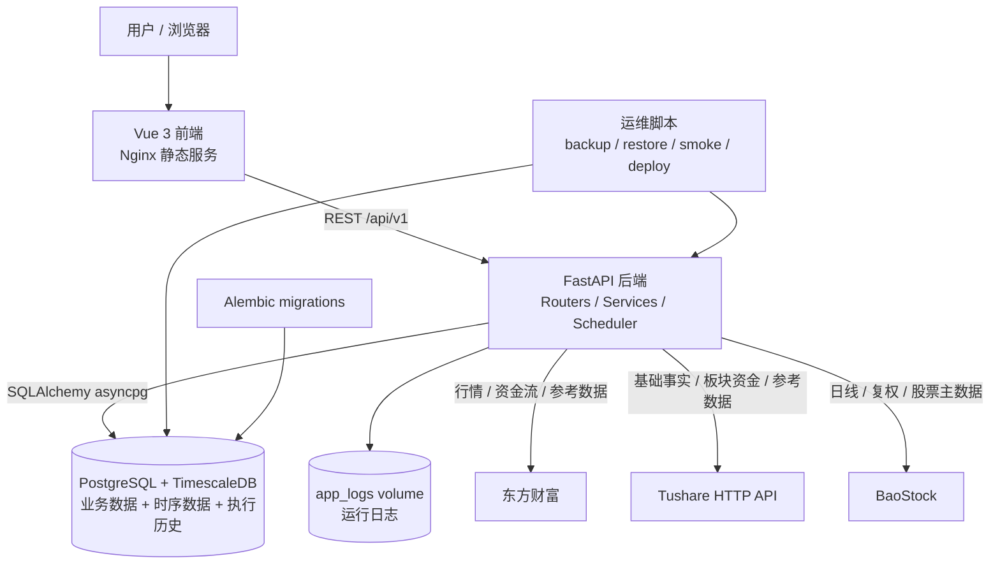
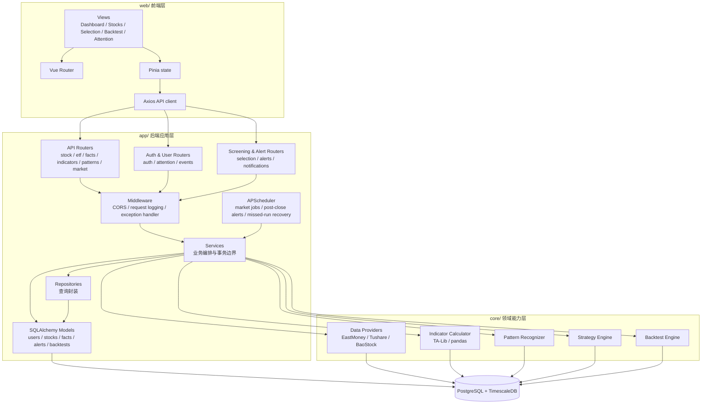
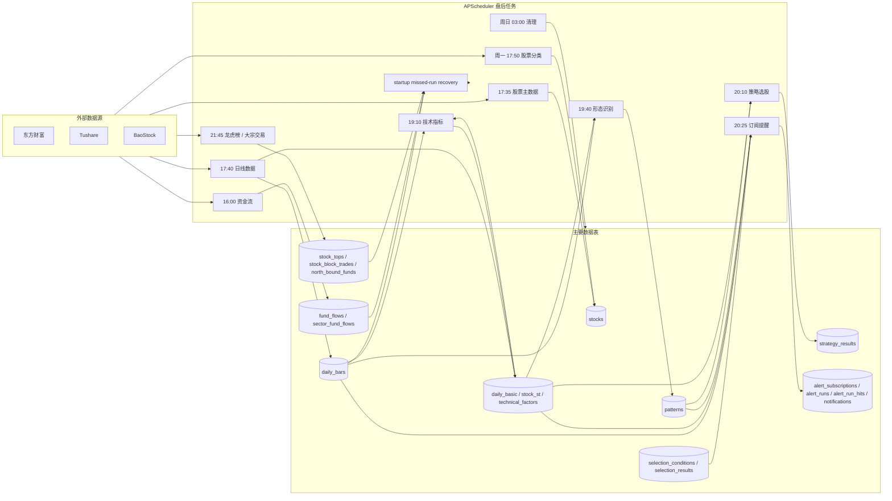
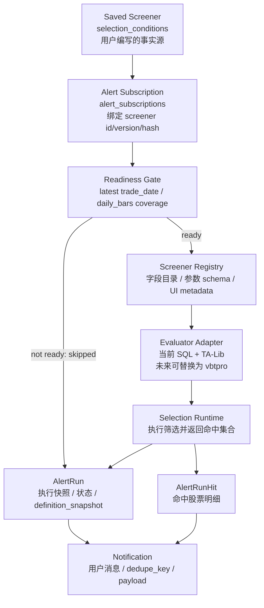
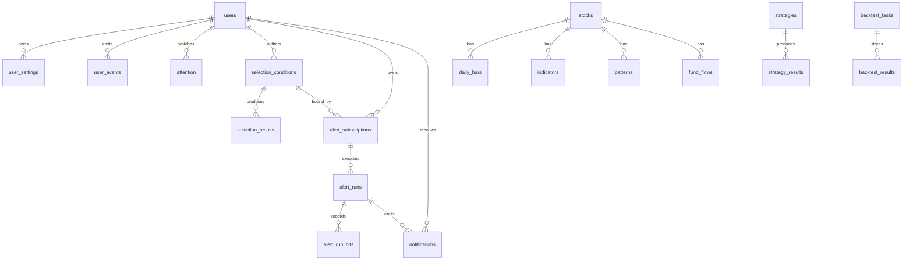

# InStock 系统架构

更新时间：2026-05-20

适用范围：当前 `main` 分支，`0.4.1+` 运行形态。

## 1. 概览

InStock 是一个面向 A 股数据分析、筛选、回测和提醒的单体应用。当前架构保持为一个 FastAPI 后端、一个 Vue 3 前端、一个 PostgreSQL/TimescaleDB 数据库，以及由 APScheduler 驱动的盘后数据任务。生产部署使用已构建镜像，数据库由部署 compose 外部管理；release staging 使用同 tag 镜像验证生产工件。

当前系统的核心原则：

- `Saved Screener` 是用户编写筛选条件的唯一事实源。
- `Alert Subscription` 只绑定筛选条件版本和投递配置，不复制筛选定义。
- `AlertRun / AlertRunHit / Notification` 是执行历史和投递记录，不反向充当配置。
- 市场数据任务和告警任务都以 readiness 为门禁；数据不完整时跳过，而不是降级到上一交易日。
- `core/` 提供采集、指标、形态、策略和回测能力；`app/` 负责 HTTP、服务编排、数据库模型和调度。

## 2. 系统上下文图

## 3. 运行时分层图

## 4. 数据与任务流

### Readiness 门禁

市场与提醒任务共享一条保守约束：当目标交易日缺少 `daily_bars` 或 active universe 存在 partial gap 时，任务必须跳过。订阅提醒不会因为数据缺口回退到上一交易日，也不会在不完整 universe 上产生通知。

## 5. 筛选与订阅提醒架构

运行约束：

- 手动触发和盘后调度都进入 `AlertSubscriptionService.run_subscription()`。
- 同一订阅、同一交易日通过执行记录和通知 `dedupe_key` 去重。
- 修改 `Saved Screener` 后，订阅进入 stale 状态；再次运行必须先显式刷新绑定版本。
- startup missed-run checker 只补 latest trade date 的缺失 run，不承担历史 backfill。

## 6. 部署架构

```mermaid
flowchart TB
    subgraph prod["Production: docker-compose.deploy.yml"]
        prodFront["instock_frontend\ninstock/instock-frontend:APP_VERSION\nhost 3001 -> container 80"]
        prodApp["instock_app\ninstock/instock-app:APP_VERSION\nhost 8000 -> container 8000"]
        prodDb[("external instock_postgres\nPostgreSQL + TimescaleDB\ninstock_network")]
        prodLogs[("external instock_fastapi_app_logs")]
        prodFront --> prodApp
        prodApp --> prodDb
        prodApp --> prodLogs
    end

    subgraph staging["Release Staging: docker-compose.staging.release.yml"]
        stageFront["instock_staging_frontend\nsame release image tag\nhost 3003 -> container 80"]
        stageApp["instock_staging_app\nsame release image tag\nhost 8002 -> container 8000"]
        stageDb[("instock_staging_postgres\nTimescaleDB\nhost 5434 by default")]
        stageFront --> stageApp
        stageApp --> stageDb
    end

    subgraph dev["Development: docker-compose.dev.yml"]
        devFront["instock_dev_frontend\nbuild from web/\nhost 3002 -> container 80"]
        devApp["instock_dev_app\nbind-mounted app/core/scripts/config\nhost 8001 -> container 8000"]
        devDb[("instock_dev_postgres\nTimescaleDB\nhost 5433 -> container 5432")]
        devFront --> devApp
        devApp --> devDb
    end
```

部署边界：

- 生产 compose 只管理 app/frontend 容器和 app 日志 volume，不创建生产数据库。
- release staging 使用和生产相同的镜像 tag，适合合并后验证迁移、健康、API 合同、scheduler/readiness 和 smoke。
- dev compose 使用 bind mount，适合日常开发，不应作为 release artifact 的最终证据。
- 当前 compose 文件没有启用 Redis、Prometheus 或 Grafana；`core/storage/redis.py` 是可选能力，不是默认运行依赖。

## 7. 主要数据库域

重要表组：

- 用户与行为：`users`、`user_settings`、`user_events`、`attention`。
- 市场主数据与事实：`stocks`、`daily_bars`、`daily_basic`、`stock_st`、`technical_factors`。
- 分析结果：`indicators`、`patterns`、`strategy_results`、`selection_results`。
- 筛选与提醒：`selection_conditions`、`alert_subscriptions`、`alert_runs`、`alert_run_hits`、`notifications`。
- 市场参考：`stock_tops`、`stock_block_trades`、`stock_bonus`、`stock_limitup_reasons`、`sector_fund_flows`、`north_bound_funds`。
- 回测：`strategies`、`backtest_tasks`、`backtest_results`。

## 8. 技术栈

| 层级 | 当前技术 |
| --- | --- |
| 前端 | Vue 3, TypeScript, Vite, Pinia, Vue Router, Axios, ECharts, Element Plus |
| 后端 API | Python 3.11+, FastAPI, Pydantic Settings, SQLAlchemy 2.x async, asyncpg |
| 任务调度 | APScheduler, startup missed-run recovery, single-process file lock |
| 数据库 | PostgreSQL + TimescaleDB, Alembic migrations |
| 数据与计算 | pandas, NumPy, TA-Lib, EastMoney/Tushare/BaoStock providers |
| 部署 | Docker, Docker Compose, Nginx static frontend image |
| 验证 | pytest, ruff, black, vue-tsc, vite build, smoke scripts, compose config checks |

## 9. 代码位置速查

| 能力 | 主要位置 |
| --- | --- |
| FastAPI 入口与 router 注册 | `app/main.py` |
| API 路由 | `app/api/routers/` |
| 服务层 | `app/services/` |
| 数据模型 | `app/models/stock_model.py` |
| 数据访问封装 | `app/repositories/` |
| 定时任务 | `app/jobs/scheduler.py`, `app/jobs/tasks/` |
| 采集、指标、形态、策略、回测核心 | `core/` |
| 前端应用 | `web/` |
| 迁移 | `alembic/versions/` |
| 环境编排 | `docker-compose.dev.yml`, `docker-compose.staging.release.yml`, `docker-compose.deploy.yml` |
| 发布验证脚本 | `scripts/smoke_api_contracts.py`, `scripts/deploy_release.sh` |
