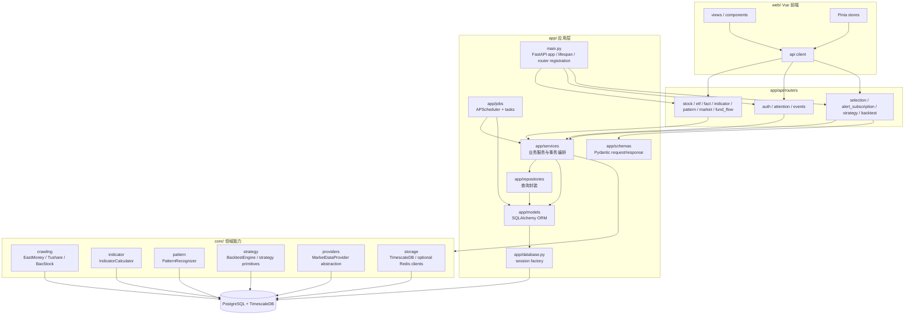
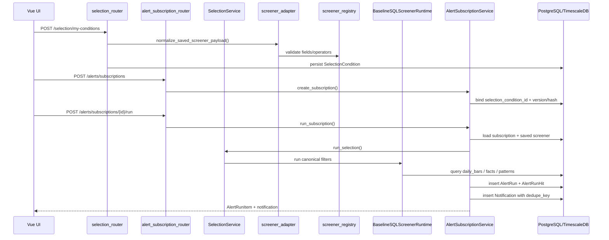
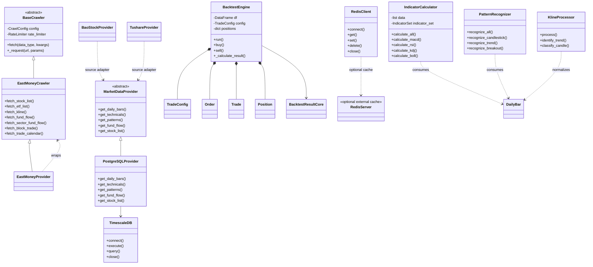

# InStock 代码结构 UML

更新时间：2026-05-20

适用范围：当前 `main` 分支，`0.4.1+` 代码结构。本文档用于快速理解代码组织、关键类关系和主要调用边界；字段只列关键属性，完整字段以源码为准。

## 1. 模块依赖图

## 2. ORM 数据模型类图

源码：`app/models/stock_model.py`

```mermaid
classDiagram
    class Base {
        <<DeclarativeBase>>
    }

    Base <|-- User
    Base <|-- UserSettings
    Base <|-- UserEvent
    Base <|-- Stock
    Base <|-- DailyBar
    Base <|-- FundFlow
    Base <|-- Attention
    Base <|-- AlertCondition
    Base <|-- Notification
    Base <|-- Indicator
    Base <|-- Pattern
    Base <|-- DailyBasic
    Base <|-- StockST
    Base <|-- TechnicalFactor
    Base <|-- Strategy
    Base <|-- StrategyResult
    Base <|-- BacktestResult
    Base <|-- SelectionCondition
    Base <|-- AlertSubscription
    Base <|-- AlertRun
    Base <|-- AlertRunHit
    Base <|-- SelectionResult
    Base <|-- StockTop
    Base <|-- StockBlockTrade
    Base <|-- SectorFundFlow
    Base <|-- NorthBoundFund
    Base <|-- BacktestTask

    class User {
        +int id
        +str username
        +str email
        +bool is_active
        +datetime created_at
    }

    class UserSettings {
        +int user_id
        +str language
        +str theme
        +str timezone
    }

    class UserEvent {
        +int user_id
        +str event_type
        +str page
        +dict event_data
    }

    class Stock {
        +str ts_code
        +str symbol
        +str name
        +str exchange
        +bool is_etf
    }

    class DailyBar {
        +str ts_code
        +str trade_date
        +date trade_date_dt
        +Decimal open
        +Decimal close
        +Decimal vol
    }

    class Indicator {
        +str ts_code
        +str trade_date
        +str indicator_name
        +Decimal indicator_value
    }

    class Pattern {
        +str ts_code
        +str trade_date
        +str pattern_name
        +str pattern_type
        +float confidence
    }

    class SelectionCondition {
        +int user_id
        +str name
        +dict params
        +dict definition
        +int definition_version
        +str definition_hash
    }

    class AlertSubscription {
        +int user_id
        +int selection_condition_id
        +str schedule_type
        +int definition_version
        +str definition_hash
        +str status
    }

    class AlertRun {
        +int subscription_id
        +int selection_condition_id
        +str trade_date
        +str status
        +int match_count
        +dict definition_snapshot
    }

    class AlertRunHit {
        +int alert_run_id
        +str ts_code
        +str trade_date
        +Decimal score
        +dict snapshot
    }

    class Notification {
        +int user_id
        +int subscription_id
        +int alert_run_id
        +str notification_type
        +str dedupe_key
        +bool is_read
    }

    class Strategy {
        +int user_id
        +str name
        +dict params
        +bool is_active
    }

    class StrategyResult {
        +int strategy_id
        +str ts_code
        +str trade_date
        +Decimal score
        +str signal
    }

    class BacktestTask {
        +int user_id
        +str status
        +int progress
        +dict params
    }

    class BacktestResult {
        +int user_id
        +str name
        +str start_date
        +str end_date
        +Decimal total_return
    }

    User "1" --> "0..1" UserSettings : owns
    User "1" --> "0..*" UserEvent : emits
    User "1" --> "0..*" Attention : watches
    User "1" --> "0..*" SelectionCondition : authors
    User "1" --> "0..*" AlertSubscription : owns
    User "1" --> "0..*" Notification : receives
    User "1" --> "0..*" Strategy : owns
    User "1" --> "0..*" BacktestTask : starts
    User "1" --> "0..*" BacktestResult : owns

    Stock "1" --> "0..*" DailyBar : has
    Stock "1" --> "0..*" Indicator : has
    Stock "1" --> "0..*" Pattern : has
    Stock "1" --> "0..*" FundFlow : has

    SelectionCondition "1" --> "0..*" SelectionResult : produces
    SelectionCondition "1" --> "0..*" AlertSubscription : bound_by
    AlertSubscription "1" --> "0..*" AlertRun : executes
    AlertRun "1" --> "0..*" AlertRunHit : records
    AlertRun "1" --> "0..1" Notification : emits

    Strategy "1" --> "0..*" StrategyResult : produces
    BacktestTask "1" --> "0..*" BacktestResult : stores
```

## 3. 服务层与 Repository 类图

源码：`app/services/`, `app/repositories/`

```mermaid
classDiagram
    class AsyncSession {
        <<SQLAlchemy>>
    }

    class StockRepository {
        -AsyncSession db
        +get_all()
        +get_by_ts_code()
        +get_by_symbol()
        +search_by_name()
    }

    class DailyBarRepository {
        -AsyncSession db
        +get_daily_bars()
        +get_latest_bar()
        +get_bar_by_date()
        +get_top_gainers()
    }

    class FactRepository {
        -AsyncSession db
        +get_daily_basic()
        +get_stock_st()
        +get_technical_factors()
    }

    class StockService {
        -AsyncSession db
        +get_stocks()
        +get_stock_detail()
        +get_etf_list()
        +get_etf_detail()
    }

    class MarketDataService {
        -AsyncSession db
        +get_summary()
        +get_fund_flow_rank()
        +get_block_trades()
        +get_lhb()
        +get_task_health()
    }

    class IndicatorService {
        -AsyncSession db
        +get_indicators()
        +get_latest_indicator()
    }

    class PatternService {
        -AsyncSession db
        +get_patterns()
        +get_today_patterns()
    }

    class FundFlowService {
        -AsyncSession db
        +get_fund_flow()
        +get_industry_fund_flow()
        +get_concept_fund_flow()
    }

    class AuthService {
        <<static>>
        +register()
        +authenticate()
        +create_access_token()
        +create_refresh_token()
        +verify_access_token()
    }

    class EventService {
        -AsyncSession db
        +track_event()
        -enforce_rate_limit()
    }

    class AttentionService {
        -AsyncSession db
        +get_list()
        +add()
        +update()
        +remove()
    }

    class SelectionService {
        -AsyncSession db
        +get_screening_metadata()
        +get_templates()
        +run_selection()
        +run_screening()
        +compare_results()
    }

    class AlertSubscriptionService {
        -AsyncSession db
        +list_subscriptions()
        +create_subscription()
        +run_subscription()
        +list_notifications()
        +mark_notification_read()
    }

    class StrategyService {
        -AsyncSession db
        +get_strategy_list()
        +get_strategy_templates()
        +build_selection_strategy_params()
        +build_strategy_params()
        +run_strategy()
        +get_results()
    }

    class BacktestService {
        -AsyncSession db
        +run_backtest()
        +list_results()
        +get_result()
    }

    class BacktestTaskService {
        -AsyncSession db
        +create_task()
        +get_task()
        +list_tasks()
    }

    class BaselineSQLScreenerRuntime {
        -AsyncSession db
        +run()
    }

    AsyncSession --> StockRepository
    AsyncSession --> DailyBarRepository
    AsyncSession --> FactRepository
    AsyncSession --> StockService
    AsyncSession --> SelectionService
    AsyncSession --> AlertSubscriptionService

    StockService --> StockRepository
    MarketDataService --> DailyBarRepository
    MarketDataService --> FactRepository
    IndicatorService --> DailyBarRepository
    PatternService --> DailyBarRepository
    SelectionService --> BaselineSQLScreenerRuntime
    AlertSubscriptionService --> SelectionService
    StrategyService --> SelectionService
    BacktestTaskService --> BacktestService

    AuthService --> User
    EventService --> UserEvent
    AttentionService --> Attention
    SelectionService --> SelectionCondition
    SelectionService --> SelectionResult
    AlertSubscriptionService --> AlertSubscription
    AlertSubscriptionService --> AlertRun
    AlertSubscriptionService --> AlertRunHit
    AlertSubscriptionService --> Notification
    StrategyService --> Strategy
    StrategyService --> StrategyResult
    BacktestService --> BacktestResult
    BacktestTaskService --> BacktestTask
```

## 4. 筛选与订阅提醒调用图

## 5. Core 引擎与 Provider 类图

源码：`core/`

## 6. Router 到服务的对应关系

| Router | 主要 Service / Runtime | 主要 Model |
| --- | --- | --- |
| `stock_router.py`, `etf_router.py` | `StockService` | `Stock`, `DailyBar` |
| `fact_router.py` | `FactService`, `FactRepository` | `DailyBasic`, `StockST`, `TechnicalFactor` |
| `indicator_router.py` | `IndicatorService` | `Indicator` |
| `pattern_router.py` | `PatternService` | `Pattern` |
| `market_router.py` | `MarketDataService` | `DailyBar`, `FundFlow`, `StockTop`, `StockBlockTrade` |
| `fund_flow_router.py` | `FundFlowService` | `FundFlow`, `SectorFundFlow`, `NorthBoundFund` |
| `auth_router.py` | `AuthService` | `User`, `UserSettings` |
| `events_router.py` | `EventService` | `UserEvent` |
| `attention_router.py` | `AttentionService` | `Attention`, `AlertCondition`, `Notification` |
| `selection_router.py` | `SelectionService`, `screener_adapter`, `screener_registry`, `BaselineSQLScreenerRuntime` | `SelectionCondition`, `SelectionResult` |
| `alert_subscription_router.py` | `AlertSubscriptionService`, `SelectionService` | `AlertSubscription`, `AlertRun`, `AlertRunHit`, `Notification` |
| `strategy_router.py` | `StrategyService` | `Strategy`, `StrategyResult`, `SelectionCondition` |
| `backtest_router.py` | `BacktestService`, `BacktestTaskService` | `BacktestTask`, `BacktestResult` |
